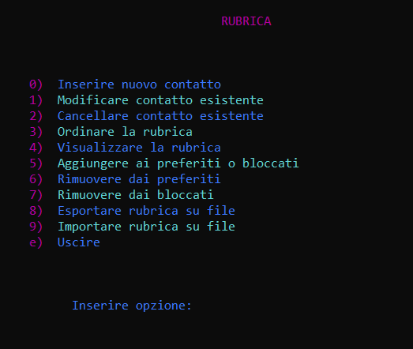

# Rubrica-Telefonica-Completa
Rubrica Telefonica Completa in C (Progetto Universitario), build di Eclipse (il prof ci ha costretto a usare sto compiler del c), purtroppo ci ha obbligato a non usare break, for, switch, e alcune funzioni già esistenti in librerie varie. Allo stesso modo dovev(am)o limitare l'uso di return vari nelle funzioni, e gestire i dati/variabili globali/costanti in modi particolari. Almeno ci ha fatto usare i colori :  )   

# 🔧 PseudoCodice, Consegne e Test
Il progetto è una semplice interfaccia per una classica rubrica telefonica, si possono aggiungere e gestire un numero illimitato di contatti. Sono presenti anche valori come stato di un contatto (preferito/bloccato) e l'intera rubrica può essere esportata su file di testo o importata. Il progetto è diviso in 4 moduli:
- **Gestire Rubrica**:   gestisce funzioni iniziali e principali (es. inserire nuovo contatto, copiare o cercare contatti);
- **Gestire Contatto**:   gestisce sottofunzioni relative ai contatti singoli (es. modificare o cancellare contatti, aggiungerli ai preferiti, bloccare contatto);
- **Gestire File**:   gestisce importazione da file, esportazione su file, gestione file errori e alcune funzioni di interfaccia;
- **Gestire Dati**:   gestisce variabili globali, costanti, tipi di dato, alcune funzioni di schermata e interfaccia, e funzioni d'accesso;

I casi di test coinvolgono solo le funzioni accessibili dall'utente, ovvero quelle presenti nella Funzione Principale. Le consegne sono le consegne intermedie effettuate di tanto in tanto prima di consegnare il progetto completo.

# 💻 Codice e funzionamento

Il codice parte da un interfaccia semplice (in foto) dalla quale si possono eseguire le operazioni principali, la rubrica è gestita come una lista a puntatori, ogni contatto è un nodo costituito da nome, cognome, numero di telefono, stato (normale/preferito/bloccato) e il puntatore.      

Ecco l'elenco delle operazioni:
- Inserire Nuovo Contatto;
- Modificare Contatto;
- Cancellare Contatto;
- Ordinare rubrica;
- Visualizzare rubrica;
- Aggiungere/Rimuovere preferiti;
- Aggiungere/Rimuovere bloccati;
- Esportare rubrica su file
- Importare rubrica da file

La funzione **`Cercare Contatto`** è molto particolare: per cercare un contatto prima bisogna digitarne il nome, subito dopo tutti i contatti in rubrica con lo stesso nome verranno copiati, aggiunti a una rubrica temporanea e mostrati all'utente; in seguito l'utente digita il cognome del contatto che vuole cercare e viene selezionato il primo contatto con quel cognome nella rubrica temporanea (in teoria dovrebbe essere il primo e anche l'unico); infine la rubrica temporanea viene svuotata (memoria non deallocata).
